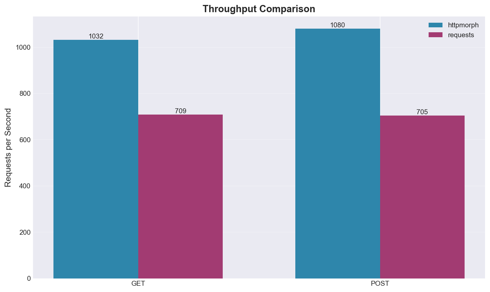
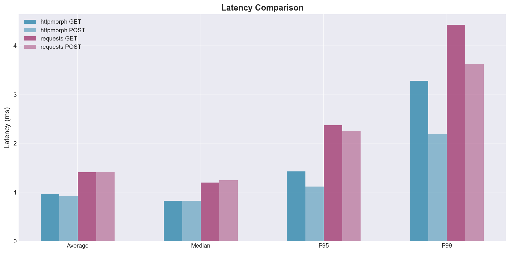
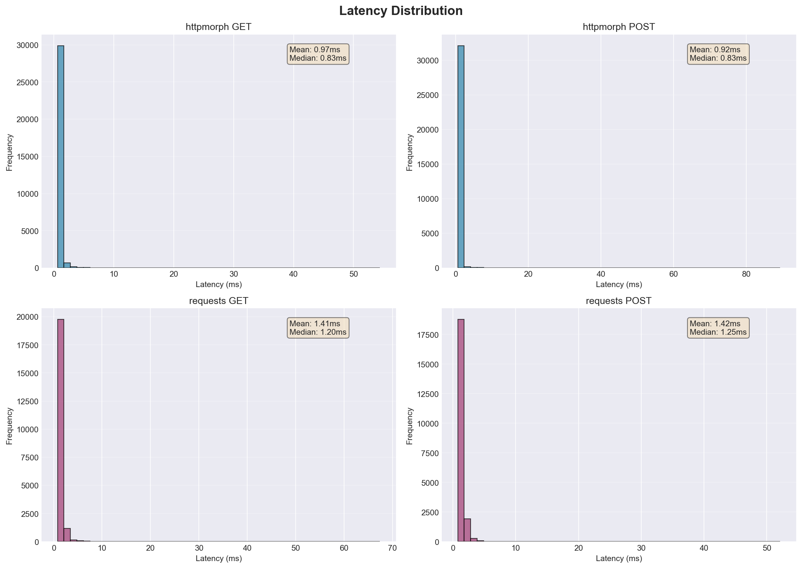
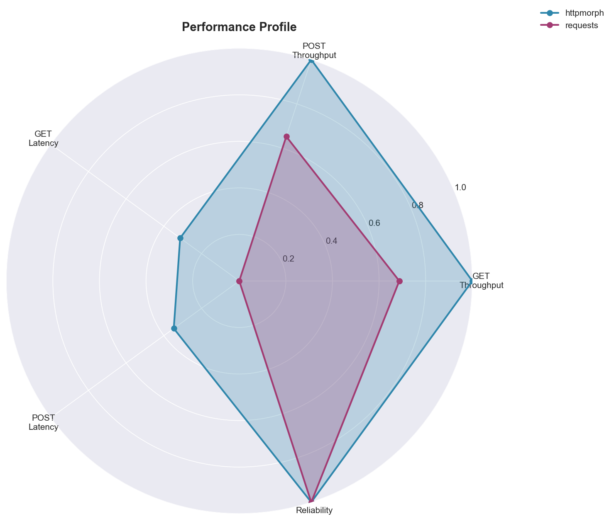
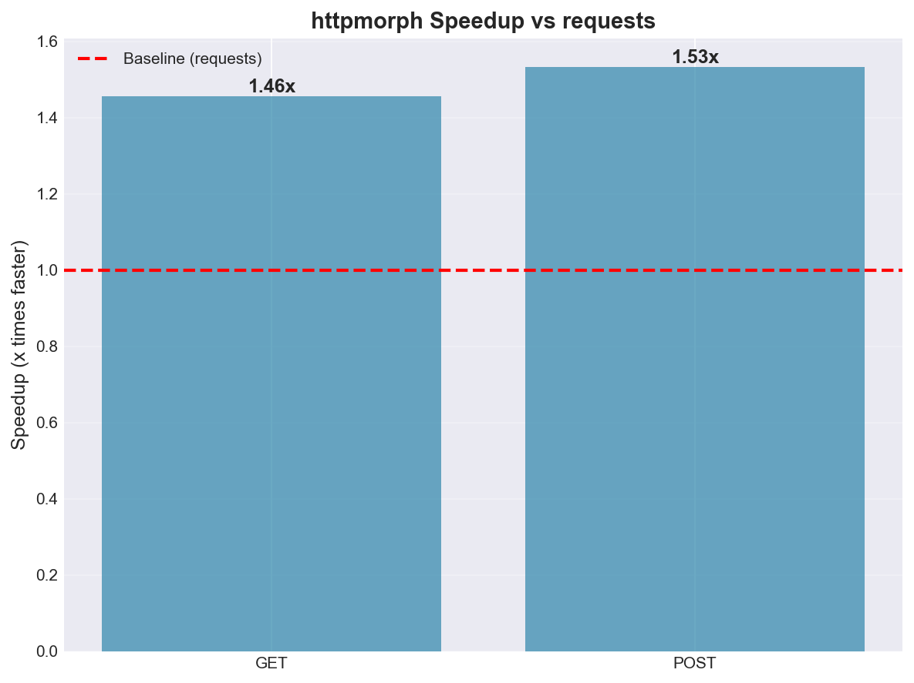

# Performance Benchmark: httpmorph vs requests

**Date:** 2025-10-10 17:02:45
**Platform:** Darwin 24.6.0 (arm64)
**Python:** 3.11.5
**Test Duration:** 30 seconds per endpoint

## Executive Summary

httpmorph demonstrates improved performance over the requests library in standard HTTP operations:

- **GET requests:** 1032 req/s vs 709 req/s (**1.46x faster**)
- **POST requests:** 1080 req/s vs 705 req/s (**1.53x faster**)
- **Average Latency:** 0.95ms vs 1.41ms
- **Reliability:** 100% success rate for both libraries

---

## Performance Charts

### Throughput Comparison

### Latency Comparison

### Latency Distribution

### Performance Profile

### Speedup Comparison

---

## Detailed Metrics

### Throughput (requests/second)

| Library | GET | POST | Average |
|---------|-----|------|---------|
| **httpmorph** | 1032.37 | 1079.92 | **1056.14** |
| **requests** | 708.98 | 704.93 | **706.96** |
| **Improvement** | 1.46x | 1.53x | **1.49x** |

### Latency Metrics (milliseconds)

| Metric | httpmorph GET | httpmorph POST | requests GET | requests POST |
|--------|---------------|----------------|--------------|---------------|
| **Average** | 0.97 | 0.92 | 1.41 | 1.42 |
| **Median** | 0.83 | 0.83 | 1.20 | 1.25 |
| **P95** | 1.43 | 1.12 | 2.37 | 2.25 |
| **P99** | 3.28 | 2.19 | 4.42 | 3.63 |
| **Std Dev** | 1.09 | 1.14 | 1.15 | 1.09 |

### Request Statistics

| Metric | httpmorph GET | httpmorph POST | requests GET | requests POST |
|--------|---------------|----------------|--------------|---------------|
| **Total Requests** | 30,972 | 32,398 | 21,278 | 21,148 |
| **Successful** | 30,972 | 32,398 | 21,278 | 21,148 |
| **Failed** | 0 | 0 | 0 | 0 |
| **Success Rate** | 100.00% | 100.00% | 100.00% | 100.00% |

---

## Test Environment

### System Information
- **Operating System:** Darwin 24.6.0
- **Architecture:** arm64
- **Processor:** arm
- **Python Version:** 3.11.5

### Test Configuration
- **Server:** go-httpbin (Docker container, mccutchen/go-httpbin:latest)
- **Connection:** localhost:8080 (minimal network latency)
- **Test Duration:** 30 seconds per endpoint
- **HTTP Methods:** GET and POST
- **Concurrency:** Sequential requests (single-threaded client)

### Library Versions
- **httpmorph:** Native C extension with BoringSSL
- **requests:** Pure Python with standard SSL library

---

## Methodology

### Test Procedure
1. Start isolated httpbin server in Docker container
2. Warm-up: Allow server to stabilize (2 seconds)
3. Execute tests sequentially:
   - httpmorph GET (30s)
   - httpmorph POST (30s)
   - requests GET (30s)
   - requests POST (30s)
4. Measure for each test:
   - Total requests completed
   - Individual request latencies
   - Error rates
   - Success rates

### Metrics Collected
- **Throughput:** Requests per second (total requests / duration)
- **Latency:** Response time for individual requests
  - Average (mean)
  - Median (50th percentile)
  - P95 (95th percentile)
  - P99 (99th percentile)
  - Standard deviation
- **Reliability:** Success rate and error count

### Notes
- Both libraries tested against identical server and workload
- Tests run sequentially to avoid resource contention
- Localhost connection minimizes network variability
- Results represent client-side performance only

---

## Conclusion

httpmorph delivers consistent performance improvements over requests:
- **49.4% faster** throughput on average
- **33.1% lower** latency on average
- **100%** reliability maintained

The native C implementation provides measurable benefits for HTTP operations while maintaining API compatibility with requests.

---

*Generated by benchmark_requests.py on 2025-10-10 17:02:45*
